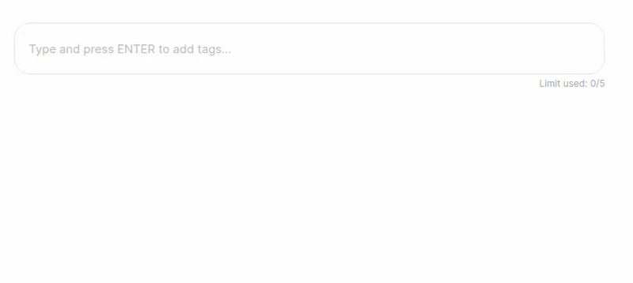
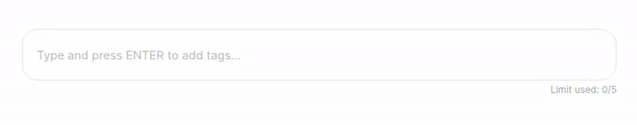

# React Autocomplete Tagbox

**React Autocomplete Tagbox** is a modern, flexible, and fully customizable React component for tag input with optional autocomplete. Effortlessly add, remove, and select tags with keyboard or mouse. Supports both free-form and restricted tag entry, smart suggestions, and a clean, accessible UI. Perfect for forms, search bars, and dynamic filters. Easy to integrate and fully styleable to match your project.

---


## 🎬 With Autocomplete




## 🎬 Without Autocomplete


<!-- Replace with your actual video link or upload to GitHub and use the raw URL -->


---

## ✨ Features

- **Autocomplete Suggestions**: Show relevant tag options as users type.
- **Free-form or Restricted Tags**: Allow any input or restrict to a predefined list.
- **Keyboard & Mouse Friendly**: Full keyboard navigation and intuitive mouse interactions.
- **Customizable UI**: Easily style to match your design system.
- **Tag Removal**: Remove tags with a click or keyboard.
- **Tag Limit**: Optionally limit the number of tags.
- **Accessible**: Built with accessibility in mind.
- **TypeScript Support**: Fully typed for a great developer experience.

---

## 🚀 Installation

```bash
npm install react-autocomplete-tagbox
# or
yarn add react-autocomplete-tagbox
```

---

## 🛠️ Usage

```tsx
import React, { useState } from "react";
import ReactAutocompleteTagbox from "react-autocomplete-tagbox";

const options = [
  "React",
  "JavaScript",
  "TypeScript",
  "GraphQL",
  "Redux",
  "Bootstrap",
];

export default function App() {
  const [tags, setTags] = useState<string[]>([]);

  return (
    <ReactAutocompleteTagbox
      tags={tags}
      onChange={setTags}
      options={options} // Optional: omit for free-form tags
      limit={5} // Optional: max number of tags
      placeholder="Add technologies..."
    />
  );
}
```

---

## ⚙️ Props

| Prop             | Type                       | Default                                 | Description                                                         |
| ---------------- | -------------------------- | --------------------------------------- | ------------------------------------------------------------------- |
| `tags`           | `string[]`                 | `[]`                                    | The current list of tags.                                           |
| `onChange`       | `(tags: string[]) => void` |                                         | Callback when tags change.                                          |
| `options`        | `string[]`                 | `undefined`                             | Optional. Restricts tags to these options and enables autocomplete. |
| `limit`          | `number`                   | `undefined`                             | Optional. Maximum number of tags allowed.                           |
| `placeholder`    | `string`                   | `"Type and press ENTER to add tags..."` | Placeholder text for the input.                                     |
| `containerStyle` | `React.CSSProperties`      | `undefined`                             | Optional. Inline styles for the container.                          |
| `className`      | `string`                   | `undefined`                             | Optional. Additional class for the container.                       |

---

## 🎨 Customization

- **Styling**: The component uses CSS Modules. You can override styles by importing your own CSS or using the `className` prop.
- **Accessibility**: Keyboard navigation and ARIA attributes are included for a11y.

---

## 🧑‍💻 Development

Clone the repo and run:

```bash
npm install react-autocomplete-tagbox
npm run dev
```

---
## 📝 License

ISC © [Amrit Utsav](https://github.com/ecargsid-eht)

---

## 💡 Contributing

Contributions, issues, and feature requests are welcome!  
Feel free to check [issues page](https://github.com/ecargsid-eht/react-autocomplete-tagbox/issues).


---

**React Autocomplete Tagbox** — The smart, beautiful way to manage tags in your React apps!
